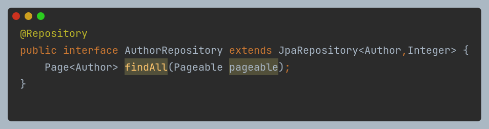

# Pagination in Author API

## Overview
This project implements pagination for retrieving authors using Spring Boot, Spring Data JPA, and RESTful APIs. The `AuthorController` provides an endpoint to fetch authors with pagination support.
## Pre-Deployment

run this command <br>
>`mysql -u your_username -p your_database < script.sql`
## How It Works
### 1. **Controller Layer (AuthorController)**

- The `viewAuthors` endpoint is accessible via `GET /api/authors`.
- It accepts a pageable request using `@PageableDefault(size = 10) Pageable pageable`.
- The `pageable` object specifies the page number and size for pagination.
- The `X-Client-Type` request header determines the response format:
    - If the client type matches the predefined list (`postman`, `front-end`), it returns the full `Page<AuthorDTO>`.
    - Otherwise, it returns only the list of authors (`List<AuthorDTO>`).

### 2. **Service Layer (AuthorService & AuthorServiceImpl)**


- The `view` method in `AuthorServiceImpl` fetches paginated data from `AuthorRepository`.
- It uses the `PaginationUtils.enforceMaxPageSize()` method to enforce a maximum page size of 25.
- The `AuthorMapper` is used to convert `Author` entities to `AuthorDTO` objects.

### 3. **Repository Layer (AuthorRepository)**

- Extends `JpaRepository<Author, Integer>` to enable CRUD operations.
- Provides the `findAll(Pageable pageable)` method for fetching paginated data.

### 4. **DTO Layer (AuthorDTO)**


- The `AuthorDTO` class is used for transferring author data without exposing entity details.

### 5. **Pagination Utility (PaginationUtils)**


- Limits the maximum page size to 25 using `Math.min(pageable.getPageSize(), MAX_PAGE_SIZE)`.

### 6. **Client Validation (RequestConfiguration)**


- Maintains a predefined list of valid client types.
- Checks if the incoming `X-Client-Type` matches the allowed clients.

## Example API Requests
### Fetch Authors (Default Pagination)
```http
GET /api/authors
```
_Response:_
```json
[
    {
        "id": 1,
        "firstName": "John",
        "lastName": "Doe",
        "email": "john.doe@example.com",
        "birthdate": "1990-01-01",
        "added": "2024-01-01"
    }
]
```

### Fetch Authors with Custom Page Size
```http
GET /api/authors?page=1&size=5
```

### Fetch Authors with X-Client-Type Header
```http
GET /api/authors
X-Client-Type: postman
```
_Response:_
```json
{
    "content": [...],
    "pageable": {...},
    "totalPages": 5,
    "totalElements": 50
}
```

## Conclusion
This implementation ensures efficient data retrieval using pagination while allowing flexibility in response formatting based on client type. The `PaginationUtils` class enforces best practices for performance by limiting the maximum page size.


## Example API Requests
### Fetch Authors (Default Pagination)
```http
GET /api/authors
```
_Response:_
```json
[
  {
    "id": 1,
    "firstName": "Luis",
    "lastName": "Herman",
    "email": "manuela.daniel@example.net",
    "birthdate": "2015-07-23",
    "added": "2015-11-19"
  },
  {
    "id": 2,
    "firstName": "Lorenzo",
    "lastName": "Shanahan",
    "email": "evalyn.ankunding@example.org",
    "birthdate": "1974-08-27",
    "added": "1998-06-14"
  }
]
```

### Fetch Authors with Custom Page Size
```http
GET /api/authors?page=1&size=5
```

### Fetch Authors with X-Client-Type Header
```http
GET /api/authors
X-Client-Type: front-end
```
_Response:_
```json
{
  "content": [
    {
      "id": 1,
      "firstName": "Luis",
      "lastName": "Herman",
      "email": "manuela.daniel@example.net",
      "birthdate": "2015-07-23",
      "added": "2015-11-19"
    }
  ],
  "pageable": {
    "pageNumber": 0,
    "pageSize": 25,
    "totalPages": 4,
    "totalElements": 100
  }
}
```

Postman: https://documenter.getpostman.com/view/26334403/2sAYdhKqe2